# PasteIt

**Copy anything. PasteIt guesses what you want to do next and does it in one keystroke.**

[](https://github.com/jstdlee/pasteit/actions/workflows/release.yml) [](https://github.com/jstdlee/pasteit/releases/latest)

PasteIt is a clipboard action popup for Linux (X11) and Windows. Press `Ctrl+Alt+F` (configurable) after copying something. PasteIt reads the clipboard and the window you are working in, works out what the content is, and offers the handful of things you most likely want to do with it: paste it, save it, pretty-print it, chart it, translate it, anonymize it, pipe it through `sort | uniq -c`, and so on. A structured decision model (Jev) ranks the choices, and the ranking learns from your habits. Actions are always fixed native code, never model-generated commands.

## Gallery

**Main input types.** The same hotkey adapts to what you copied, and Jev (or Cloudflare Clef) ranks the likely next step first. Search, tasks, help and settings sit at the top right on every tab.

| CSV table | JSON (preview / compare on the card) | URL |
|---|---|---|
| 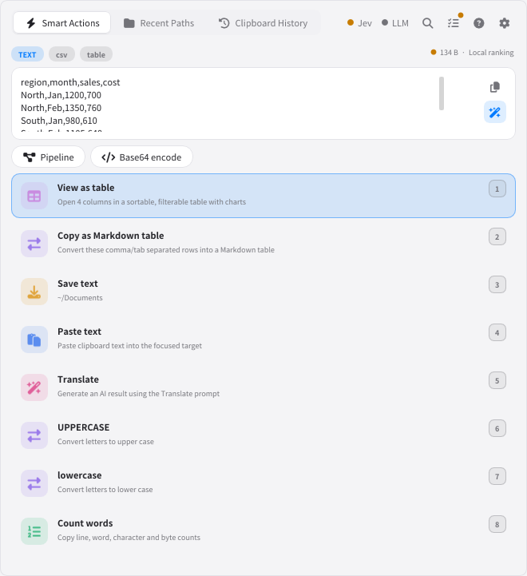 | 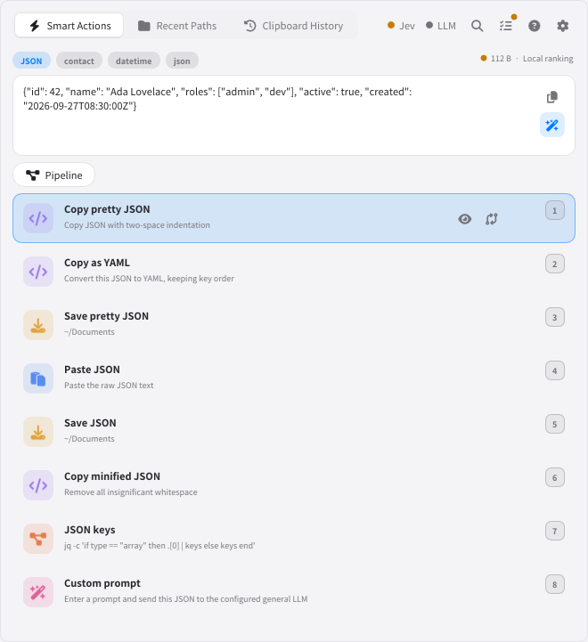 | 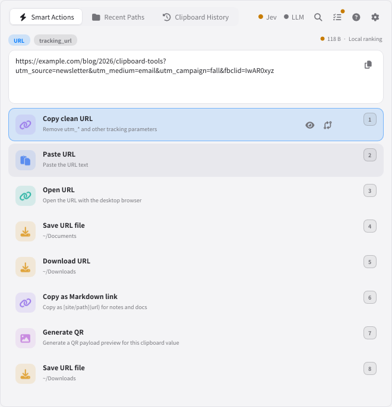 |
| **Subnet / IP** | **Personal data** | **Image** |
| 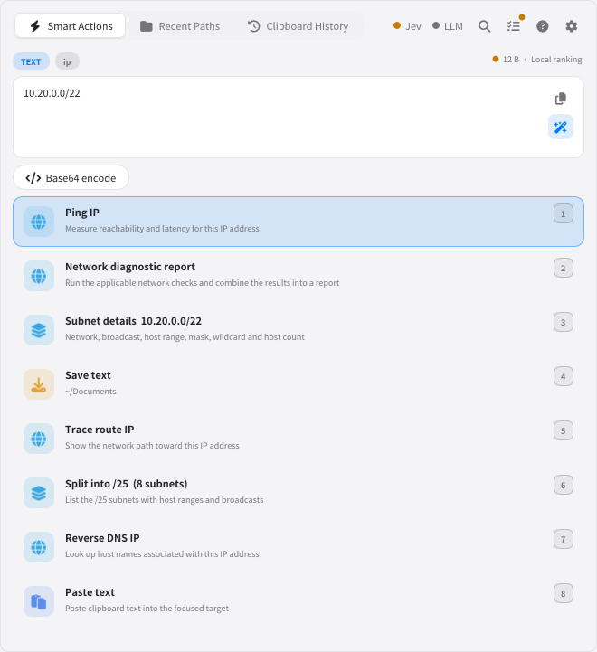 | 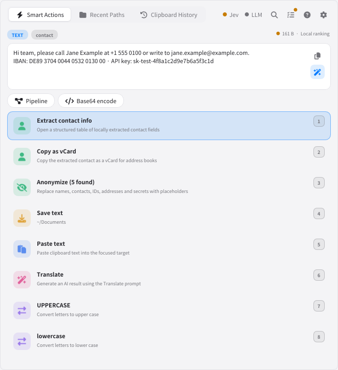 | 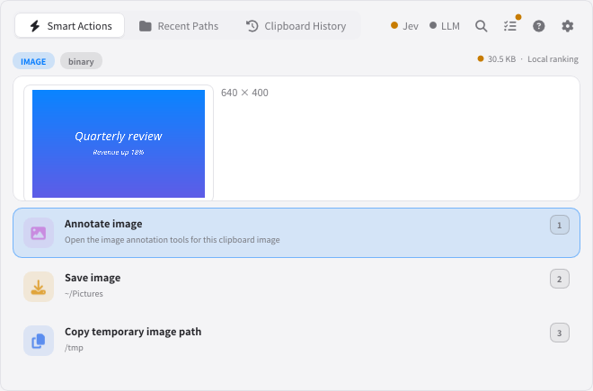 |

**Find anything, compare before you act, and keep an eye on background work.**

| Command palette (`Ctrl+P`) | Compare (side by side) |
|---|---|
| 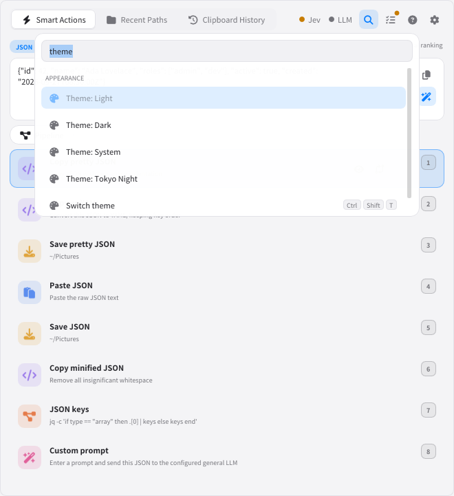 | 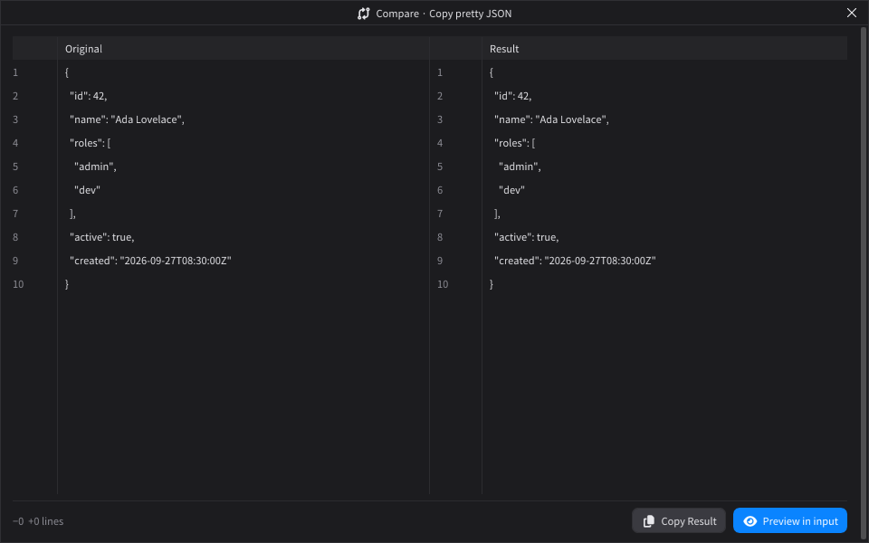 |
| **Tasks and logs (`Ctrl+J`)** | **Help (`F1`)** |
| 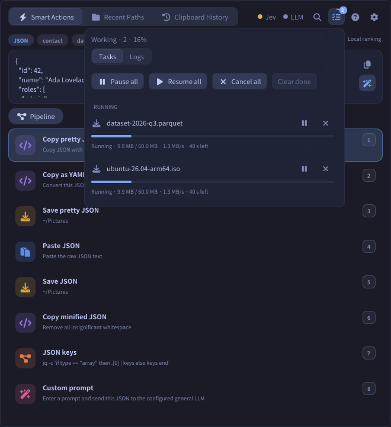 | 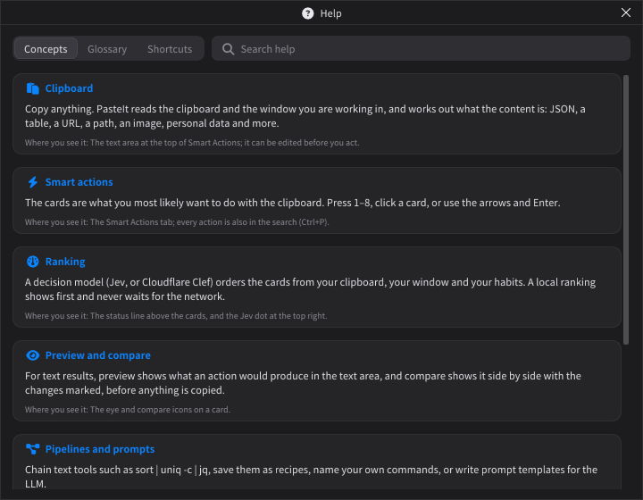 |

**Sub-windows.** Actions open focused tools owned by the popup.

| Table view | Chart (X / Y / Agg) |
|---|---|
| 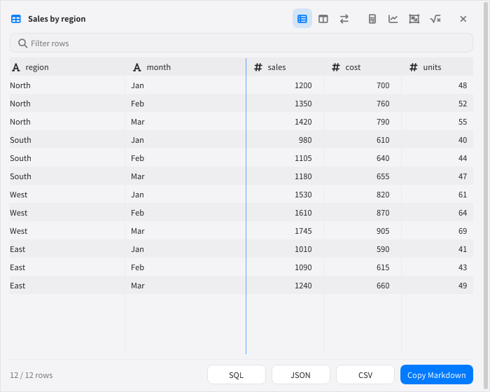 | 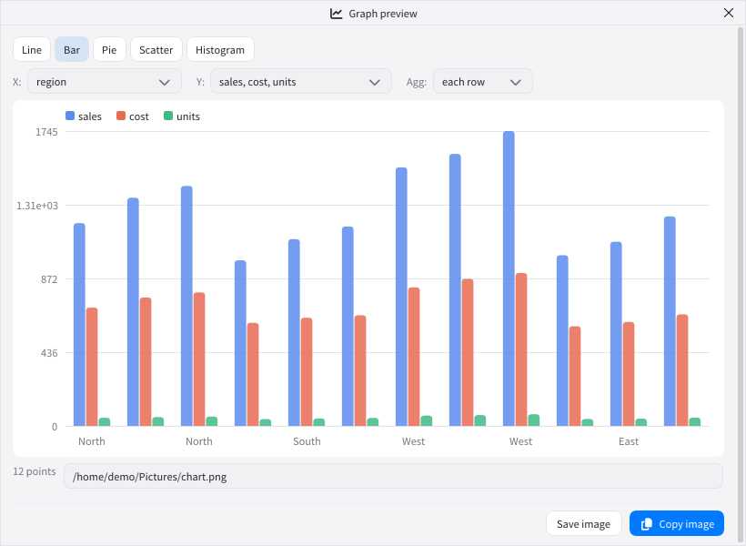 |
| **Anonymize** | **Image annotation** |
| 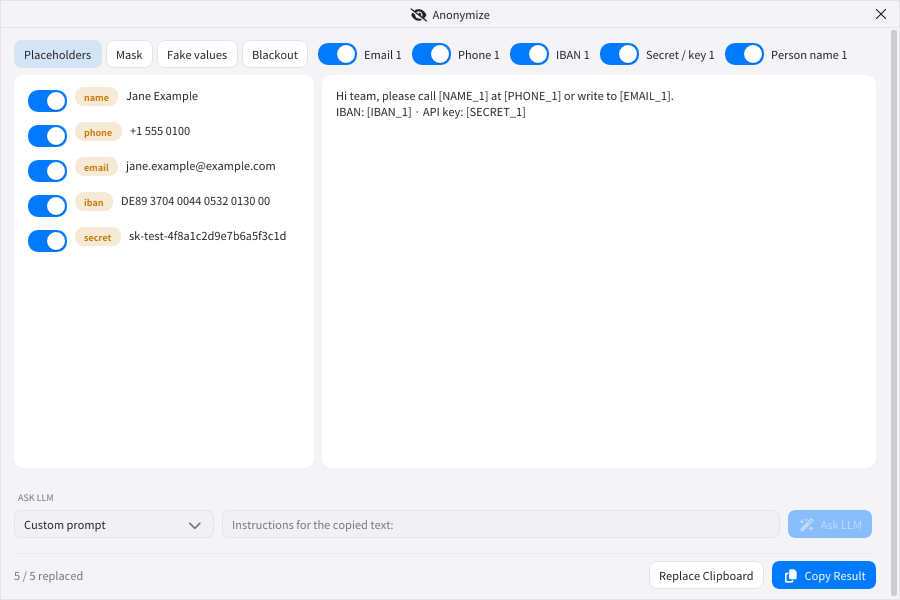 | 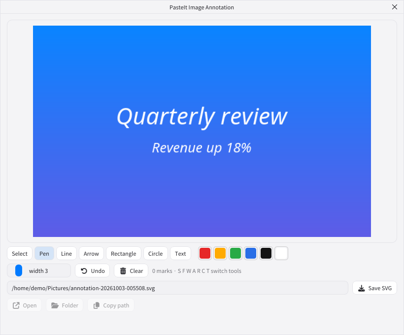 |

**Settings, themes and languages.**

| Home | Prompt templates and optimizer | 日本語 · Tokyo Night |
|---|---|---|
| 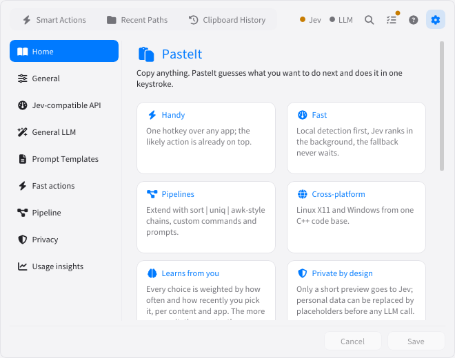 | 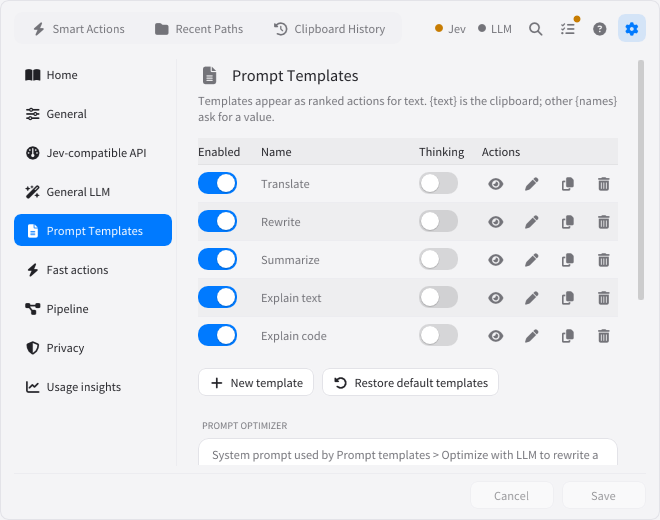 | 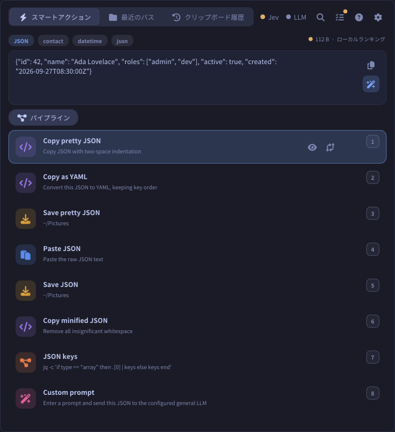 |

## Principles

| | Principle | What it means in practice |
|---|---|---|
| ✋ | **Handy** | One global hotkey works over any app. The popup opens next to your work, the likely action is already on top, and number keys `1`–`8` run it. The preview text is editable before you act. |
| ⚡ | **Fast** | Local detection is instant, and the local fallback ranking is ready before Jev answers. Jev ranks a small bounded request (≤ 26 actions, ≤ 10 KiB) in the background, and nothing waits on the network to show the popup. |
| 🔗 | **Pipelines for extension** | Every text action can be followed by a pipeline (`sort`, `uniq`, `grep`, `cut`, `awk`, `jq`, …), a saved recipe, your own named commands, or a prompt template. New behaviour is a line in Settings, not a rebuild. |
| 🖥️ | **Cross-platform** | One C++20 code base with Dear ImGui. Native clipboard, focus, terminal, file-picker and network adapters for Linux X11 and Windows. |
| 🧠 | **Learns from you** | Every pick is weighted by how often and how recently you choose it, for this kind of content, in this app, at this time of day, and fed back into Jev's ranking and the local fallback. The more you use PasteIt, the smarter the first card becomes. |
| 🛡️ | **Private by design** | Jev sees only a short preview and action descriptions. Personal data can be swapped for placeholders before any LLM call and restored in the answer. |

### Reduce repeated work, save life

Most clipboard work is the same few moves repeated hundreds of times a week:

- copy → open an editor → paste → save as → pick a folder → type a name
- copy JSON → open a formatter site → paste → copy back
- copy a CSV → open a spreadsheet → insert chart
- copy an IP → open a terminal → type `ping`

PasteIt turns each of these into **copy → hotkey → one key**. It remembers which action you choose for which kind of content, in which app, and at what time of day, so the next time the right action is already first. Destinations are ranked by how often and how recently you used them. Seconds saved per paste add up to hours per month.

## How input is handled

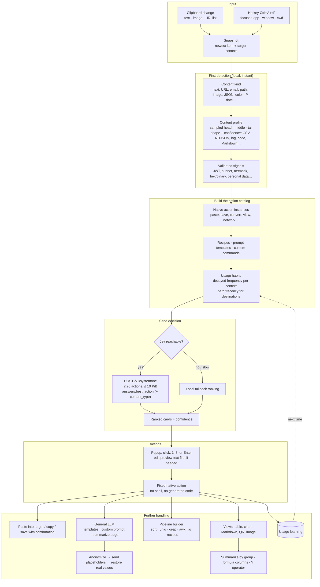

What leaves the machine: Jev receives a truncated preview (256 characters), the content profile, destination folders, and short action descriptions. It never receives clipboard history. The general LLM receives text only when you pick an LLM action, and receives placeholders instead of personal data when privacy mode is on.

## Feature gallery

Each row lists the content that is detected, the decisions offered, and a typical use.

| Content (detected when) | Actions offered | Use case |
|---|---|---|
| **Any text** | Paste, Save text (to ranked recent folders), Explain, Translate, Rewrite, Summarize, custom prompt, QR (≤ 512 bytes) | Save a snippet into the project folder you used last, with a generated `yyyyMMddHH-NN.txt` name |
| **Text utilities** | UPPER / lower / Title case, tidy whitespace, sort lines, remove duplicates, word count | Clean a copied list before pasting it into a ticket |
| **Encodings** | Base64 / URL / hex bytes / 8-bit binary, encode and decode (decode only when the result is readable) | Inspect a Base64 header value |
| **Numbers** (`255`, `0xff`, `0b1111_1111`, `0o377`) | Convert between decimal, hex, binary and octal | Read a register value |
| **Number series** | Sum, mean, median, min, max, Graph | Chart a column of latencies |
| **CSV / TSV / pipe tables, JSON arrays, NDJSON** | View as table, Copy as Markdown table, chart, pipeline recipes (Sum column 2, First column) | Sort, filter, summarize by group, add `price × qty`, then chart the result |
| **JSON** | Pretty, minify, YAML, CSV, jq-style paths, save (keys stay in order) | Turn an API response into YAML for a config |
| **Markdown** | Preview (headings, lists, tables, code), copy HTML or plain text | Check a README snippet before posting |
| **Code** | Explain code, Save as `.py` / `.cpp` / … with the detected extension | Keep a snippet from a chat |
| **Logs** | Errors only, count occurrences, pipeline | `grep -i error \| sort \| uniq -c \| sort -nr` |
| **URL** | Open, paste, clean tracking (`utm_*`, `fbclid`), Markdown link, URL-decode, QR, download (resumable), Summarize page | Summarize an article without leaving the editor |
| **GitHub URL** | Copy HTTPS / SSH remote, clone | Clone a repo into the directory you are in |
| **Email address** | Paste, compose, save `.eml`, QR | Start a mail from a signature |
| **Contact / business card** | Extract fields, vCard copy / save, JSON | Save a contact from an email footer |
| **Resume-like text** | Extract fields as text or JSON, save | Log a candidate |
| **Path / `file://`** | Copy or move to a recent folder, open, reveal, terminal here, copy name / parent, SHA-256 / 512 | Move a download into the project you use most |
| **Image** | Paste, save original bytes, zoomable preview, annotate (SVG) | Save a screenshot straight into `~/Pictures/…` |
| **Color** (`#hex`, `rgb()`, `hsl()`) | Copy as HEX / RGB / HSL, with a swatch | Convert a design token |
| **IPv4 / IPv6** | Ping, traceroute, reverse DNS, dig, combined report; IP ↔ hex ↔ integer | Check a host from a log line |
| **Subnet** (`10.1.2.0/24`, `ip mask`) | Network, broadcast, host range, wildcard, split into smaller prefixes | Plan a VLAN split |
| **Netmask** (`255.255.255.0`, `/24`, `0xFFFFFF00`) | Prefix ↔ mask ↔ wildcard ↔ binary, host count | Translate a firewall rule |
| **Date / time / Unix timestamp** | Convert time zone, to Unix time, normalized copy | Read a UTC log timestamp in local time |
| **JWT / UUID** | Decode header and claims with expiry; generate UUID v4 | Check why a token is rejected |
| **Diagram-like text** | Mermaid (offline HTML or PNG via `mmdc`) | Render a flow described in a chat |
| **Personal data** (names, email, phone, IDs, cards, IBAN, keys…) | Anonymize (placeholders, mask, fake, blackout), Ask LLM safely, restore placeholders | Ask an LLM about a customer email without sending the customer's details |

Every text action can be followed by **Run pipeline** or a **saved recipe**, and every recipe and prompt template joins the ranked list.

## Supported decision and LLM APIs

### Jev structured decisions (`/v1/systemone`)

PasteIt posts a typed-decision request and reads `answers.best_action`:

```jsonc
// request (abridged)
{
  "model": "typed-decisions",
  "request_id": "req_…",
  "state": {
    "clipboard": { "kind": "text", "preview": "region,month,sales…", "size_bytes": 86,
                   "profile": { "shape": "csv", "confidence": 0.95, "columns": 4, "header": true } },
    "target":    { "app": "code", "window_title": "…", "current_directory": "~/dev/app" },
    "destination_paths": [ { "ref": "p1", "path": "~/Documents", "kind": "directory" } ],
    "habits": [ { "action_id": "a_view_table_…", "share": 0.6, "count": 12 } ]
  },
  "questions": {
    "best_action":  { "type": "choice", "instructions": "Choose the most useful current clipboard action.",
                      "criteria": { "a_view_table_…": "Open 4 columns in a sortable table", "…": "…" } },
    "content_type": { "type": "choice", "criteria": { "csv": "…", "log": "…" } }   // only when the local guess is unsure
  }
}
// response
{ "request_id": "req_…",
  "answers": { "best_action": { "choice": "a_view_table_…", "confidence": 0.71, "probabilities": { "…": 0.71 } },
               "content_type": { "choice": "csv", "confidence": 0.9 } } }
```

Configuration:

- The endpoint is set in Settings → Jev-compatible API, or with `DJEV_URL` (default `http://127.0.0.1:8011`). A base URL gets `/v1/systemone` appended.
- The model comes from `DJEV_MODEL` (default `typed-decisions`).
- The optional bearer key comes from `DJEV_API_KEY`, or `API_KEY` from `.env` / `PASTEIT_ENV_FILE`.
- Old settings pointing at the retired AutoJev default (`:8000`, model `autojev`) are migrated automatically.
- Requests time out after 30 s, and the local fallback ranking is shown meanwhile.

**Cloudflare Clef.** [Clef](https://blog.cloudflare.com/clef-decision-models) (`@cf/cloudflare/clef`, and the faster `@cf/cloudflare/clef-flash`) speaks the same protocol on Workers AI and works as the Jev endpoint:

- Endpoint: `https://api.cloudflare.com/client/v4/accounts/<account-id>/ai/run/@cf/cloudflare/clef` (used as it is, no `/v1/systemone` suffix).
- Model: `clef`; API key: a Cloudflare API token with Workers AI access.
- PasteIt sends Clef the strict body (`model`, `state`, `questions` only) and reads the answer from Workers AI's `result` envelope.

### OpenAI-compatible LLM (`/v1/chat/completions`)

Any OpenAI-compatible server works: OpenAI, OpenCode, vLLM, llama.cpp, Ollama, or a local diffusion LLM.

- Set the endpoint, model and key in Settings → General LLM. A base URL is normalized to `/v1/chat/completions`, and the model list is loaded from `/v1/models`.
- HTTPS works with libcurl, with the `curl` executable when libcurl headers are absent (JSON headers are added automatically), or with WinHTTP on Windows.
- A server that rejects `temperature` gets one retry without it, and PasteIt remembers that endpoint.
- OpenCode Go endpoints get a per-request `x-opencode-session` header.
- Settings → Home shows both providers, each with a one-click test.
- **Prompt templates** can be edited in Settings → Prompt templates. In the editor, **Optimize with LLM** rewrites a rough draft into a clear, precise prompt with an explicit output format, keeping every `{placeholder}` (and using `{text}` once); Revert restores the draft. Built-in templates also have **Reset to default**, which puts back the shipped prompt. *Restore default templates* brings back deleted built-in templates and leaves edited ones alone.
- The **Prompt optimizer** instructions sit under the template list on the same page, with their own reset.
- Placeholders such as `{source_language}` / `{target_language}` are editable wherever a template runs (the action card, the Ask LLM dialog and Anonymize → Ask LLM), with a dropdown of common languages; values are remembered per template.

## Download

Every push to `main` is built, tested and published by GitHub Actions ([`.github/workflows/release.yml`](.github/workflows/release.yml)) as a release named `build-<n>`, with the commit messages since the previous build as release notes.

- **[Latest release](https://github.com/jstdlee/pasteit/releases/latest)** and **[all releases](https://github.com/jstdlee/pasteit/releases)**
| | Linux x86_64 | Linux arm64 (aarch64) | Windows x64 |
|---|---|---|---|
| Installer | `pasteit-linux-x86_64.deb` | `pasteit-linux-arm64.deb` | `pasteit-windows-x64-setup.exe` |
| Single file | `pasteit-linux-x86_64.AppImage` | `pasteit-linux-arm64.AppImage` | |
| Portable zip | `pasteit-linux-x86_64.zip` | `pasteit-linux-arm64.zip` | `pasteit-windows-x64.zip` |

- **.deb:** `sudo apt install ./pasteit-linux-<arch>.deb` installs to `/opt/pasteit`, adds a menu entry, an icon and the `pasteit` command.
- **AppImage:** `chmod +x pasteit-linux-<arch>.AppImage`, then run it.
- **Windows installer:** installs to Program Files with a Start menu entry and an uninstaller.
- **Zip:** unzip and run `./pasteit` (X11 desktop) or `pasteit.exe`, then press `Ctrl+Alt+F`.
- **Where settings live.** A zip copy keeps `settings.json` and `data/` next to the program (portable). An installed copy, an AppImage, or any copy in a read-only folder uses `~/.config/pasteit` and `~/.local/share/pasteit` on Linux (`$XDG_CONFIG_HOME` / `$XDG_DATA_HOME`), or `%APPDATA%\PasteIt` on Windows.
- **Software rendering:** start with `--software-render` (or `PASTEIT_SOFTWARE_GL=1`) to use Mesa's software OpenGL on ARM boards or virtual machines whose GPU driver misbehaves.

## Quick start

```bash
./scripts/bootstrap-local-deps.sh        # headers-only sysroot under .deps/ (no sudo), if dev packages are missing
cmake -S . -B build -DPASTEIT_BUILD_TESTS=ON -DPASTEIT_BUILD_DESKTOP=ON
cmake --build build -j
ctest --test-dir build --output-on-failure
PASTEIT_SHOW_ON_START=1 ./build/pasteit   # then copy something and press Ctrl+Alt+F
```

Prerequisites:

- CMake 3.20+ and a C++20 compiler.
- X11/OpenGL headers on Linux, or the Windows SDK.
- GLFW 3.4, Dear ImGui 1.92.9b-docking and `stb_image.h` are fetched by CMake at pinned revisions.
- `mmdc` is optional (Mermaid PNG). The offline Mermaid bundle and the native QR encoder are built in.

`settings.json` and `data/` (clipboard history, usage, paths) live beside the executable. The CTest suite is offline. Two live checks are available:

- `djev_live_integration` needs a running Jev.
- `openai_live_integration` reads `GENERAL_LLM_URL` / `GENERAL_LLM_MODEL` / `GENERAL_LLM_API_KEY`, and skips with code 77 without them.

## Using the popup

- **Open, run, hide.** Copy something, press `Ctrl+Alt+F`, then click a card, press `1`–`8`, or use Up/Down and Enter. Escape hides the popup.
- **Your own shortcut.** Settings > General > Global shortcut: click the button and press a new combination. PasteIt checks it live (is another application holding it?), against your GNOME or KDE keybindings, and against well-known system and editing shortcuts (Alt+Tab, Win+L, Ctrl+V, AltGr combinations on Windows). A shortcut that cannot work is refused; one that shadows something else is saved with a warning. The old shortcut stays active until the new one is registered.
- **Edit before acting.** The preview is an editable text area: change the text, then press Ctrl+Enter or click ✓. The edit becomes a new clipboard item and the actions re-rank.
- **Preview and compare.** Cards whose result is text (case changes, JSON pretty/minify/YAML, Base64, URL encoding, sort, …) show two icons. **Preview** puts the result in the text area, and the icon turns into *restore*. **Compare** opens a side-by-side diff: removed and added lines are tinted, and the changed characters are marked. The copy button next to the text area always copies what is shown, a preview included.
- **Ask LLM** is the highlighted button in the text area's corner (`Ctrl+L`), under Copy.
- **Base64.** Encode / decode chips appear under the text area when those actions are not already among the ranked cards.
- **Window behaviour.** The popup has no title bar; drag the tab row to move it, and drag its left or right edge to make it wider (the width is remembered; the height follows the content). It is a normal window (not always-on-top). Sub-windows (confirmations, views, results) are owned by the popup and stay in front of it.
- **Tabs.** Smart Actions, Recent Paths (frecency-ranked) and Clipboard History (newest 50).
- **Top right.** Provider status, then search, tasks, help and settings, in the same place on every tab:
  - Two dots show whether Jev and the general LLM are reachable: green is OK, yellow is down, grey is not configured. They are re-checked every minute (Jev `GET /health`, the LLM `GET /v1/models`, so no tokens are spent) and right after settings change; hover for details, click to check now.
  - **Search** (`Ctrl+P`, also `Ctrl+K`) opens the command palette: every action the current clipboard offers (not only the top eight), the tabs and settings pages, theme and language, the last 15 clipboard items, and app commands. It matches the English name in any language, and an empty search lists recent commands first.
  - **Tasks and logs** (`Ctrl+J`): downloads, network checks, clones, hashing, renders, LLM answers, page fetches and provider tests run in the background. A ring around the icon shows the overall progress (amber when paused) with a count; a red dot marks a failure, an amber dot a new warning. The popover lists each task with its own bar, size, speed and time left, with pause / resume (downloads), cancel, retry and remove, plus *Pause all*, *Resume all*, *Cancel all* and *Clear done*. Unfinished downloads come back paused after a restart. The **Logs** tab filters by level, searches, copies, and opens the log folder (`data/logs/pasteit.log`).
  - **Help** (`F1`; `Ctrl+/` for the shortcut list): *Concepts* (clipboard, smart actions, ranking, preview and compare, pipelines and prompts, privacy, tasks), a *Glossary* with "Show me" links into the app, and *Shortcuts* generated from the same list the app uses, with a copy button. Everything is searchable, and help topics also appear in the command palette.
  - **Settings** (`Ctrl+,`) opens the settings pages. The sidebar border drags to resize; double-click resets it.
- **Sub-windows** (tables, charts, compare, help, confirmations) remember where you put them and their size; the first time they open centred, a double-click on the title bar centres them again, and a window left on a disconnected monitor comes back into view.
- **Shortcuts.**

  | Keys | Action |
  |---|---|
  | `Ctrl+Alt+F` (configurable) | Open PasteIt from any application |
  | `1`–`8`, Up/Down, Enter | Run a card |
  | `Ctrl+P` / `Ctrl+K` | Search actions, settings and history |
  | `Ctrl+J` | Tasks and logs |
  | `F1` / `Ctrl+/` | Help / keyboard shortcuts |
  | `Ctrl+,` | Settings |
  | `Ctrl+L` | Ask LLM about the clipboard |
  | `Ctrl+Shift+T` | Switch theme (System → Light → Dark → Tokyo Night) |
  | `Ctrl+Enter` | Apply an edit of the preview text |
  | `Esc` | Close the palette or a sub-window; hide the popup |

- **Tooltips** appear after the pointer rests for two seconds, then at once while you move between controls; icon buttons show their shortcut.
- **Settings pages.** Home (overview, provider tests, stats), General, Jev, General LLM, Prompt templates, Fast actions, Pipelines, Privacy, and Usage insights.
- **Saving files.** Save, download, copy and move actions open a confirmation window with an editable destination and a generated file name.

## Data views

- **Table:**
  - The window has its own title bar: light icon tools at the right (header row, columns, find and replace, statistics, chart, summarize, formula, undo) and a close button in the top-right corner.
  - **First row is header** can be switched on or off; off turns the header back into data and names the columns *Column 1…N*.
  - **Columns:** rename, set the type (Auto, Text, Number, Date) and show or hide each column. Headers show a type icon; right-click a header for the same options. A Number type makes the column sort numerically and feed charts and summaries.
  - **Find and replace** in one column or all of them, optionally only in the filtered rows, with **regular expressions** (`$1`, `$&` in the replacement) and match case. The number of matching cells updates as you type, and an invalid pattern shows its error.
  - **Undo** reverts the last replace, header switch, type change or formula column.
  - Sort, filter and show a statistics row (type, filled, distinct, sum/mean/min/max).
  - **Summarize** groups rows by a column and reduces the chosen value columns with **sum, avg, min, max or count**. The summary replaces the view, and Reset goes back.
  - **Formula** adds a computed number column `A + − × ÷ B`, where B is another column or a constant (for example `price × qty` or `ms ÷ 1000`).
  - Copy as Markdown, CSV, JSON or SQL `INSERT`.
- **Chart:**
  - Line, bar, pie, scatter or histogram, drawn live with hover values.
  - Pick the X column and one or more Y series. The **Y operator** (each row, sum, avg, min, max, count) reduces rows that share an X value.
  - Copy or save as PNG.
- **Markdown:** a rendered preview with copy as HTML or plain text.
- **Image annotation:** select/move (`S`), pen (`F`), line (`W`), arrow (`A`), rectangle (`R`), circle (`C`) and text (`T`) with colours and sizes; Delete removes the selection and Ctrl+Z undoes. Save SVG writes `~/Pictures/annotation-<time>.svg` (editable), then Open / Folder / Copy path.

## Pipelines

Run pipeline opens a builder with the clipboard on the left and live output on the right. Stages chain with `|`, for example `sort | uniq -c | sort -nr | head -n 10`.

- **Built-in stages** run inside PasteIt on every platform:
  - `sort` (`-n -r -u -f -k N -t SEP`), `uniq` (`-c -d -u -i`), `wc` (`-l -w -c -m`), `head` / `tail` (`-n N`)
  - `grep` (`-i -v -o -c -n -F`), `cut` (`-d -f`, `-c`), `tr`, `sed 's/re/rep/g'`
  - `nl`, `rev`, `tac`, `column`, `trim`, `upper`, `lower`, `join`, `anonymize`
- **Custom commands** (Settings → Pipelines) name a pipeline that can be used as a stage, e.g. `errors = grep -i 'error|fail'`.
- **External programs** run only if they are allowed. The defaults are `gawk`, `awk` and `jq`, or turn on Allow any program. They are started by argv with the text on stdin, never through a shell.
- **Limits.** `;`, `&`, redirects and `$(…)` are rejected, and each run is limited to 2 s and 1 MiB of output.
- **Saved recipes** apply to `lines`, `any`, or shapes such as `csv`, `json` or `log`. They appear as ranked actions.

## Privacy

Anonymize detects:

- names, emails and phone numbers
- IPv4, IPv6 and MAC addresses
- card numbers (Luhn) and IBANs
- national IDs with check digits
- addresses and birth dates
- user folders in paths
- secrets: keys, tokens, and passwords in URLs

Findings can be replaced with numbered placeholders (`[EMAIL_1]`), partial masks, realistic fake values, or blackout.

With **Hide personal data before sending to the LLM** on, prompts carry placeholders, and answers are restored to the real values locally. The mapping lives in memory for the session only. The Anonymize window can **Ask LLM** directly with any template or a custom prompt.

**Summarize page** asks for permission on first use. It downloads the page with redirects followed, no cookies, and 5 s / 2 MB limits, then extracts the readable text and sends it (anonymized if enabled) to the general LLM.

## Learning

Every choice updates `data/usage.json`, a decayed frequency model with a half-life of about 14 days. It is keyed by content kind, detected signals, focused app, and time of day. Action keys are semantic: an action kind, a destination, or a template, never clipboard text.

The model adds a bounded bonus (≤ 0.20) to both the Jev and the fallback ranking. It also sends up to five `habits` to Jev. Recent paths are ranked by use weight and then by recency. Settings → Usage insights shows the learned habits and can reset them.

## Platform notes

- **Linux:**
  - An X11 clipboard watcher and a global hotkey grab.
  - XTest, loaded at runtime, restores the target window and sends `Ctrl+V`.
  - Zenity or KDialog is used for folder picking.
  - A non-fatal X error handler keeps a destroyed sub-window from ending the process.
- **Windows:** the Win32 clipboard, WinHTTP, and native folder picker and focus adapters.
- **Fonts:** Noto Sans CJK (regular and bold) with the Font Awesome Free 6 (Solid) icon font merged in.
- **Themes:** System (follows the desktop's light/dark preference: GNOME `color-scheme` on Linux, `AppsUseLightTheme` on Windows), Light, Dark and Tokyo Night. A theme switch applies at once and is saved.
- **Languages:** English, 简体中文, 日本語 and 한국어, or follow the system locale (`zh*`, `ja*`, `ko*`). Japanese and Korean live in `src/ui/i18n/*.json` and are turned into `src/ui/localization_ja_ko.cpp` by `scripts/gen_cjk_localization.py`; CI fails when a string has no translation. Kana and Hangul come from Noto Sans CJK / Nanum on Linux and Yu Gothic, Meiryo or Malgun Gothic on Windows. Action names from the catalog are still in English.
- **Builds:** every release has Windows x64, Linux x86_64 and Linux arm64 packages (see Download), each built and tested in CI.
- **Single instance:** a per-user lock prevents duplicate processes.
